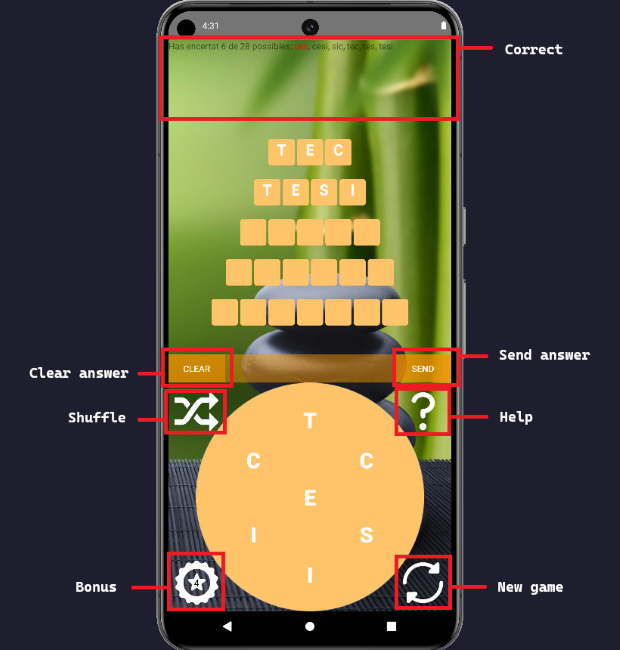

# 🪴 ZenWord

ZenWord is a clone of the famous original game where you have to guess a certain number of
words given the letters of the longest one. It is called "zenword" because it has been with the
intention of inducing some kind of "relaxation" using zen backgrounds and smooth colors.

This project was developed for the final project of the course Algorithms and Data Structures II 
using Android Studio and with the collaboration of [Marc Link](https://github.com/linkcla).

## 🎮 Gameplay

When you open the app, you will see the main screen, where the game is played.
<p align="center">
    
</p>

## 🔨 How to try it

To try our game, you have two options:

### From source code

- Clone our repository with the following command:

```
https://github.com/jcasben/zenword.git
```

- Open the cloned directory with Android Studio
- Select your device / emulator
- Start playing!
  
### From the apk

- Download the current release in your phone
- Install de apk
- Start playing!